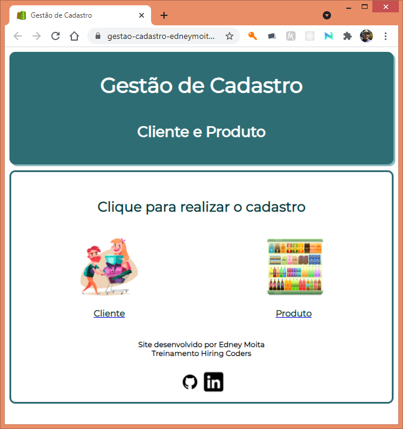
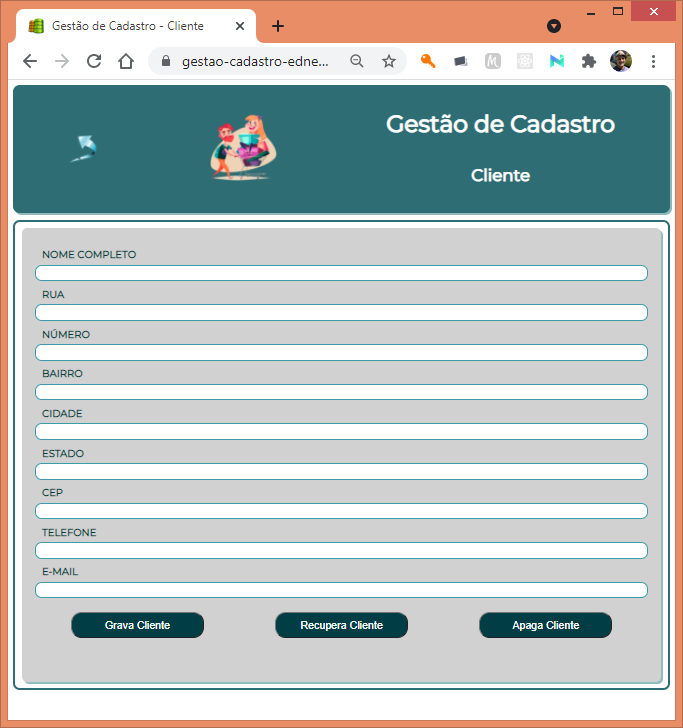
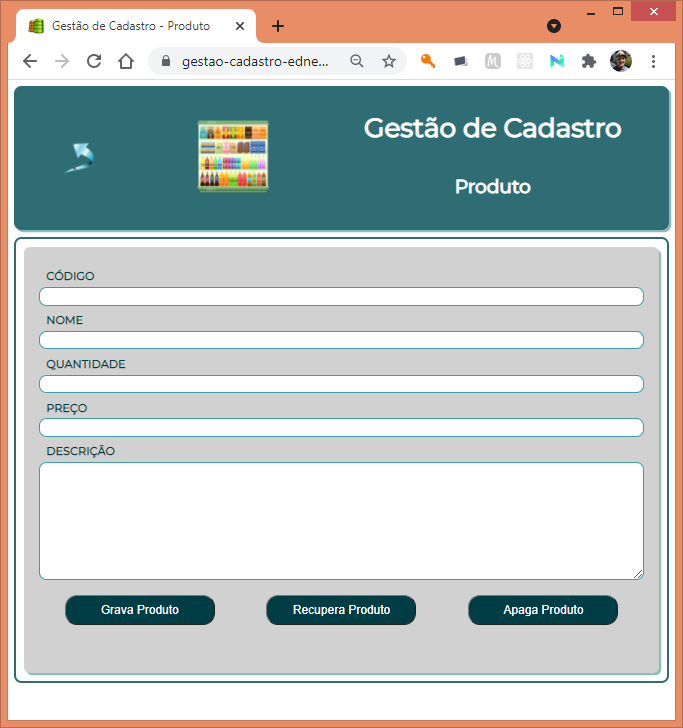

# Gestão de Cadastro - Cliente e Produto

Módulo simples para cadastro de cliente e produto, armazenados no formato JSON no localStorage.

Desenvolvido como parte do treinamento Hiring Coders - VTEX.
 
 
    

***
## Instalação

Aplicação Web. Não necessita de instalação.

***
## URL

[https://gestao-cadastro-edneymoita.vercel.app/](https://gestao-cadastro-edneymoita.vercel.app/)

***
## Desenvolvido em

     

***

## Funcionalidades

Na tela inicial escolha cliente ou produto para cadastrar um novo item. 
 
 

 
 
Preencha os dados solicitados e clique no botão **Grava Cliente/Produto**.
 
 

 
 

 
 
Caso queira verificar se já existe algum cliente/produto cadastrado, clique no botão **Recupera Cliente/Produto**.
 
 
Caso queira apagar o cliente/produto que está cadastrado, clique no botão **Apaga Cliente/Produto**.

***

## Licença

[EM](https://github.com/edneymoita)